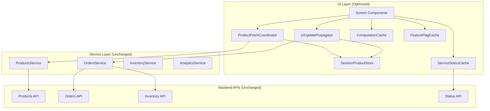

# Design Document

## Overview

This design implements advanced UI-level performance optimizations for FlowPOS through sophisticated data coordination, intelligent session management, and comprehensive UI propagation mechanisms. The design strictly preserves backend authority, maintains all API contracts, and provides complete rollback safety.

The optimization strategy focuses on reducing redundant API calls while ensuring that critical operations (inventory validation, order creation, payment processing) always execute through backend services. All optimizations are implemented as UI-layer enhancements that can be instantly disabled without affecting core business logic.

## Architecture

### Core Principles

1. **Backend Authority**: Backend services remain the single source of truth for all business-critical operations
2. **API Contract Preservation**: No changes to existing endpoints, payloads, or response formats
3. **Session-Only Caching**: All optimizations use in-memory storage that clears on logout/restart
4. **Rollback Safety**: Single configuration flag can disable all optimizations instantly
5. **UI-Layer Only**: All optimizations exist at the presentation layer without affecting business logic

### System Architecture Diagram



## Components and Interfaces

### ProductFetchCoordinator

**Purpose**: Single entry point for all product data requests with intelligent caching

**Interface**:
```javascript
class ProductFetchCoordinator {
  static async fetchProducts(forceRefresh = false)
  static clearCache()
  static isDataValid()
}
```

**Behavior**:
- Routes all product requests through single coordination point
- Checks SessionProductStore first for cached data
- Forces API call when forceRefresh=true (manual refresh)
- Updates SessionProductStore on successful API responses
- Handles all error scenarios with appropriate fallbacks

### SessionProductStore

**Purpose**: In-memory storage for products during app session

**Interface**:
```javascript
class SessionProductStore {
  static getProducts()
  static setProducts(products, timestamp)
  static clear()
  static isValid()
  static getLastFetch()
}
```

**Behavior**:
- Stores products array and lastFetch timestamp in memory only
- Clears completely on logout or app restart
- Never persists to AsyncStorage or permanent storage
- Never used for inventory validation or order processing

### UIUpdatePropagator

**Purpose**: Propagates successful API operations across UI components

**Interface**:
```javascript
class UIUpdatePropagator {
  static async propagateProductCreate(newProduct)
  static async propagateProductUpdate(updatedProduct)
  static async propagateProductDelete(productId)
  static async propagateOrderSuccess(order, updatedProducts)
}
```

**Behavior**:
- Updates SessionProductStore after successful API operations
- Triggers UI re-renders across all screens
- Never performs optimistic updates before API confirmation
- Handles order success by updating UI-only stock levels

### ComputationCache

**Purpose**: Caches expensive analytics calculations

**Interface**:
```javascript
class ComputationCache {
  static getAnalytics(ordersHash)
  static setAnalytics(ordersHash, computedResults)
  static clear()
  static invalidate()
}
```

**Behavior**:
- Reuses results when orders data unchanged (based on hash)
- Recomputes when orders data changes
- Clears on manual refresh regardless of data changes
- In-memory only, clears on logout/restart

### ServiceStatusCache

**Purpose**: Session-level caching for service status checks

**Interface**:
```javascript
class ServiceStatusCache {
  static getStatus(serviceName)
  static setStatus(serviceName, status, timestamp)
  static clearAll()
  static forceRecheck(serviceName)
}
```

**Behavior**:
- Stores first status check result in session memory
- Reuses cached result across screens
- Forces recheck on manual refresh or setup/config screens
- Clears on logout or app restart

### FeatureFlagCache

**Purpose**: Render-cycle caching for feature flag evaluations

**Interface**:
```javascript
class FeatureFlagCache {
  static evaluateFeature(featureName, context)
  static clearRenderCache()
  static isFeatureEnabled(featureName)
}
```

**Behavior**:
- Evaluates feature flags once per render cycle
- Reuses results within same render cycle only
- Never persists across render cycles or screens
- Maintains identical feature access behavior

## Data Models

### Product Session Data
```javascript
{
  products: Array<Product>,
  lastFetch: timestamp,
  isValid: boolean
}
```

### Computation Cache Entry
```javascript
{
  ordersHash: string,
  computedResults: Object,
  timestamp: timestamp
}
```

### Service Status Entry
```javascript
{
  serviceName: string,
  status: boolean,
  lastCheck: timestamp,
  isValid: boolean
}
```

### Feature Flag Cache Entry
```javascript
{
  featureName: string,
  isEnabled: boolean,
  renderCycle: string,
  context: Object
}
```

## Correctness Properties

*A property is a characteristic or behavior that should hold true across all valid executions of a system-essentially, a formal statement about what the system should do. Properties serve as the bridge between human-readable specifications and machine-verifiable correctness guarantees.*

### Property 1: Single Entry Point Enforcement
*For any* product data request from any screen, the request should be routed through ProductFetchCoordinator and never directly to productsService.getProducts()
**Validates: Requirements 1.1, 1.2, 1.6, 11.1, 11.2**

### Property 2: Session Store Lifecycle Management
*For any* session data (products, computation cache, service status, feature flags), when logout occurs or app restarts, all session stores should be completely cleared
**Validates: Requirements 2.4, 2.5, 5.5, 7.6**

### Property 3: Manual Refresh Cache Bypass
*For any* manual refresh action, all caches should be bypassed, API should be called directly, and session stores should update only on success
**Validates: Requirements 1.7, 4.10, 5.3, 7.3, 11.5**

### Property 4: Successful API Operation UI Propagation
*For any* successful product API operation (create/update/delete), SessionProductStore should be updated and UI should re-render across all screens without additional API calls
**Validates: Requirements 3.1, 3.2, 3.3, 3.4**

### Property 5: API Failure No-Change Guarantee
*For any* failed API operation, no changes should be made to UI state or session stores
**Validates: Requirements 3.5, 4.5**

### Property 6: Order Success Dual API Execution
*For any* order creation attempt, both inventory validation API and order creation API should always execute in sequence, with UI updates only after both succeed
**Validates: Requirements 4.6, 4.7, 4.8**

### Property 7: Order Success UI Propagation
*For any* successful order creation, UI-only stock levels, order lists, analytics data, and counters should update across all screens without additional API calls
**Validates: Requirements 4.1, 4.2, 4.3, 4.4**

### Property 8: Computation Cache Consistency
*For any* analytics computation with identical orders data, the cached result should be identical to a fresh computation
**Validates: Requirements 5.1, 5.2, 5.4**

### Property 9: Feature Flag Render Cycle Caching
*For any* feature flag evaluation within a single render cycle, the cached result should be identical to direct evaluation and not persist across render cycles or screens
**Validates: Requirements 6.1, 6.2, 6.3, 6.4, 6.5**

### Property 10: Service Status Session Caching
*For any* service status check within a session, subsequent checks should return cached result unless manual refresh or config screen access forces recheck
**Validates: Requirements 7.1, 7.2, 7.3, 7.4, 7.5**

### Property 11: API Contract Immutability
*For any* API endpoint, the request payload, response format, and behavior should remain identical before and after optimization implementation
**Validates: Requirements 8.1, 8.2, 8.6, 8.7, 8.8**

### Property 12: Critical API Preservation
*For any* order creation flow, inventory validation API and order creation API should always execute and never be bypassed by optimizations
**Validates: Requirements 8.3, 8.4, 8.5, 4.8, 4.9**

### Property 13: Session Data Non-Persistence
*For any* session data stored by optimizations, no data should persist to AsyncStorage or any permanent storage mechanism
**Validates: Requirements 2.6, 8.10, 12.2**

### Property 14: Order Session Store Prohibition
*For any* order data, full order history should never be cached in session stores, with backend remaining authoritative source
**Validates: Requirements 12.1, 12.4, 12.5, 12.6**

### Property 15: Rollback Completeness
*For any* system state, when rollback flag is enabled, all behavior should be identical to pre-optimization direct API reads
**Validates: Requirements 9.2, 9.3, 9.4, 9.7**

### Property 16: Background Fetch Read-Only Behavior
*For any* background fetch operation, only read operations should occur with silent session store updates and no UI updates for inactive screens
**Validates: Requirements 13.2, 13.3, 13.5, 13.7**

## Error Handling

### API Failure Scenarios
- **Product API Failure**: Return cached data if available, otherwise propagate error to UI
- **Order API Failure**: No UI updates, maintain existing state, show error to user
- **Service Status Failure**: Use cached status if available, otherwise assume service unavailable
- **Computation Failure**: Fall back to direct computation without caching

### Cache Invalidation Scenarios
- **Logout**: Clear all session stores and caches immediately
- **App Restart**: All session data automatically cleared by memory cleanup
- **Manual Refresh**: Force clear all caches and refetch from API
- **API Error**: Maintain existing cache state, do not clear on failure

### Rollback Scenarios
- **Performance Issues**: Single flag disables all optimizations instantly
- **Data Inconsistency**: Rollback preserves all existing functionality
- **Integration Problems**: No backend changes required for rollback

## Testing Strategy

### Dual Testing Approach
The system requires both unit testing and property-based testing to ensure comprehensive coverage:

- **Unit tests**: Verify specific examples, edge cases, and error conditions
- **Property tests**: Verify universal properties across all inputs
- Both approaches are complementary and necessary for complete validation

### Property-Based Testing Configuration
- **Testing Library**: fast-check for JavaScript property-based testing
- **Test Iterations**: Minimum 100 iterations per property test
- **Test Tagging**: Each test tagged with **Feature: advanced-ui-performance, Property {number}: {property_text}**

### Unit Testing Focus Areas
- **Coordinator Integration**: Verify ProductFetchCoordinator routes all requests correctly
- **Session Management**: Test SessionProductStore lifecycle and clearing behavior
- **UI Propagation**: Verify UIUpdatePropagator triggers re-renders appropriately
- **Cache Behavior**: Test all cache implementations for correct storage and retrieval
- **Error Handling**: Verify graceful degradation when APIs fail
- **Rollback Mechanism**: Test that rollback flag disables all optimizations

### Property Testing Focus Areas
- **Single Entry Point**: Generate random product requests and verify routing
- **Session Lifecycle**: Test session clearing across various logout/restart scenarios
- **Manual Refresh**: Verify cache bypass behavior with random refresh triggers
- **API Preservation**: Test that all API contracts remain unchanged
- **Rollback Safety**: Verify identical behavior before/after rollback activation

### Integration Testing Requirements
- **End-to-End Flows**: Test complete user journeys with optimizations enabled
- **Performance Validation**: Measure API call reduction while maintaining functionality
- **Cross-Screen Consistency**: Verify UI updates propagate correctly across all screens
- **Backend Integration**: Ensure no changes to backend service behavior

### Validation Checkpoints
After each implementation phase:
1. Verify manual refresh bypasses all caches
2. Verify logout clears all session memory
3. Verify app restart refetches all data
4. Verify failed APIs cause no UI mutations
5. Verify no user-observable behavior changes
6. Verify network calls reduced but critical calls preserved
7. Verify rollback mechanism functions correctly