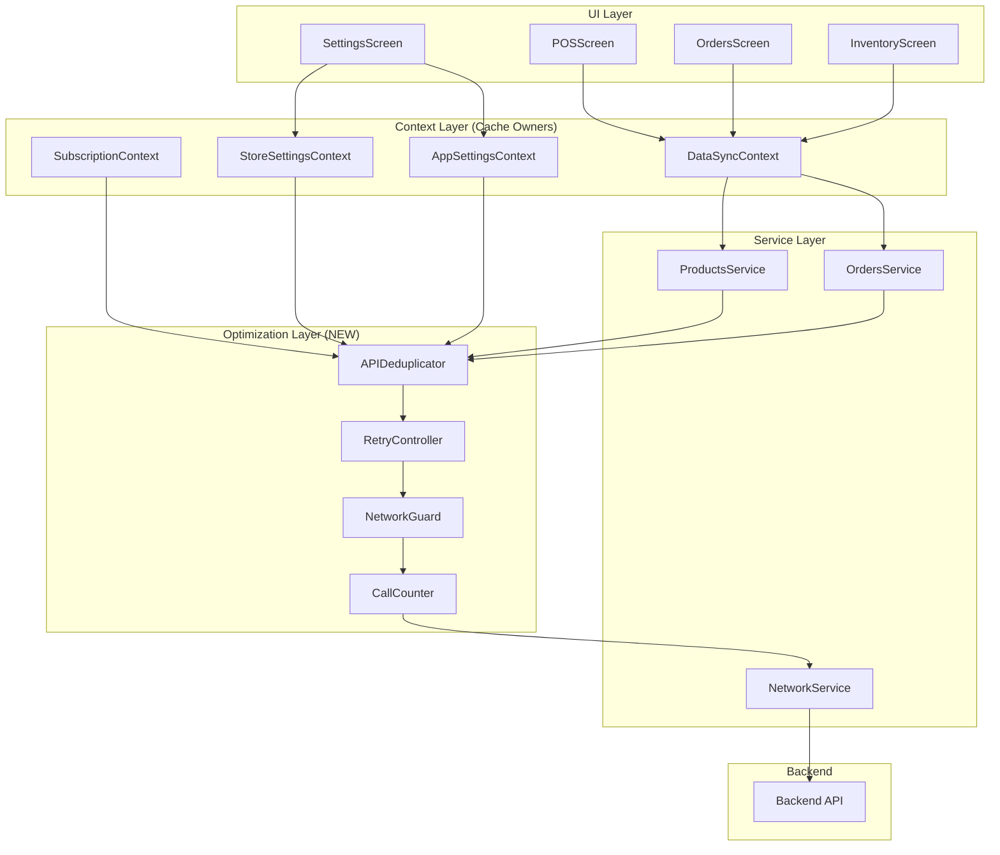

# Design Document: API Optimization

## Overview

This design document outlines the implementation approach for optimizing API usage in the FlowPOS application. The optimization focuses on reducing unnecessary API calls through deduplication, cache-first access patterns, controlled retry logic, and proper offline handling - all without changing UI/UX behavior, API contracts, or database schemas.

The existing codebase already has partial implementations of these patterns (SubscriptionContext, StoreSettingsContext, AppSettingsContext). This design extends and standardizes these patterns across all API-consuming components.

## Architecture



## Components and Interfaces

### 1. APIDeduplicator (Public Interface)

Wraps the existing internal `RequestDeduplicator` class in `flowpos/src/utils/debounce.js` to provide a clean public API for endpoint-specific deduplication. The internal `RequestDeduplicator` remains unchanged and is used only internally.

```javascript
// Public Interface (APIDeduplicator)
interface APIDeduplicator {
  // Deduplicate requests by endpoint key
  deduplicate(endpointKey: string, requestFn: () => Promise<any>): Promise<any>;
  
  // Check if request is in-flight
  isInFlight(endpointKey: string): boolean;
  
  // Clear specific or all pending requests
  clear(endpointKey?: string): void;
}

// Internal: RequestDeduplicator (unchanged, used by APIDeduplicator)
// External: APIDeduplicator (public API for services/contexts)

// Endpoint keys
const ENDPOINT_KEYS = {
  PRODUCTS: 'GET:/api/products',
  ORDERS: 'GET:/api/orders',
  STORE: 'GET:/api/store',
  SUBSCRIPTION: 'GET:/api/subscription/status'
};
```

### 2. RetryController (New)

New utility for controlled retry logic with exponential backoff.

```javascript
// Interface
interface RetryController {
  // Execute with retry logic (GET requests only)
  executeWithRetry(
    requestFn: () => Promise<Response>,
    options?: RetryOptions
  ): Promise<Response>;
}

interface RetryOptions {
  maxAttempts: number;      // Default: 3
  baseDelayMs: number;      // Default: 1000
  maxDelayMs: number;       // Default: 10000
  shouldRetry: (error: Error) => boolean;
}

// Retry logic
// Delay = min(baseDelay * 2^attempt, maxDelay)
// Attempt 1: 1000ms
// Attempt 2: 2000ms
// Attempt 3: 4000ms (capped at maxDelay)
```

### 3. NetworkGuard (Enhanced)

Enhances the existing `NetworkService` to block API calls when offline.

```javascript
// Interface
interface NetworkGuard {
  // Check if online before API call
  isOnline(): Promise<boolean>;
  
  // Execute API call with offline guard
  guardedApiCall(
    endpoint: string,
    options: RequestOptions
  ): Promise<Response>;
}

// Behavior
// - Returns immediately with clean error when offline
// - Does NOT queue calls
// - Does NOT write to cache when offline
```

### 4. CallCounter (New)

New utility for tracking API call counts per session with soft limits.

```javascript
// Interface
interface CallCounter {
  // Increment call count for endpoint
  increment(endpoint: string): void;
  
  // Get current count for endpoint
  getCount(endpoint: string): number;
  
  // Check if threshold exceeded (logs warning)
  checkThreshold(endpoint: string): boolean;
  
  // Reset all counts (on session start)
  reset(): void;
}

// Thresholds (per hour)
const CALL_THRESHOLDS = {
  'GET:/api/products': 20,
  'GET:/api/orders': 20,
  'GET:/api/store': 10,
  'GET:/api/subscription/status': 5
};
```

### 5. Screen Lifecycle Hooks (Enhanced)

Standardized hooks for screen lifecycle API management.

```javascript
// Enhanced useFocusEffect pattern
const useOptimizedFocus = (
  fetchFn: () => Promise<void>,
  options: {
    checkCache: () => boolean;
    getLastFetch: () => number | null;
    staleness: number;
  }
) => {
  useFocusEffect(
    useCallback(() => {
      // Check cache first
      if (options.checkCache()) {
        const lastFetch = options.getLastFetch();
        const isStale = !lastFetch || (Date.now() - lastFetch > options.staleness);
        
        if (!isStale) {
          // Cache is fresh, skip API call
          return;
        }
      }
      
      // Cache miss or stale, fetch in background
      fetchFn();
    }, [])
  );
};
```

## Data Models

### CacheEntry

```javascript
interface CacheEntry<T> {
  data: T;
  timestamp: number;
  isStale: boolean;
}

// Staleness calculation
const STALENESS_THRESHOLD_MS = 24 * 60 * 60 * 1000; // 24 hours

function isStale(timestamp: number): boolean {
  return Date.now() - timestamp > STALENESS_THRESHOLD_MS;
}
```

### APICallRecord

```javascript
interface APICallRecord {
  endpoint: string;
  count: number;
  lastCalled: number;
  sessionStart: number;
}
```

## Correctness Properties

*A property is a characteristic or behavior that should hold true across all valid executions of a system - essentially, a formal statement about what the system should do. Properties serve as the bridge between human-readable specifications and machine-verifiable correctness guarantees.*

### Property 1: Request Deduplication Invariant

*For any* API endpoint and any set of concurrent requests to that endpoint, all requests SHALL receive the same promise reference, and only one actual network call SHALL be made.

**Validates: Requirements 1.1, 1.2, 1.3, 1.4, 1.5**

### Property 2: Cache-First Access Pattern

*For any* non-frequent data request (store settings, app settings, subscription) where valid cached data exists (not stale), the Cache_Manager SHALL return cached data without making an API call.

**Validates: Requirements 2.1, 2.2, 2.3, 2.4, 2.5, 8.1, 8.2, 8.3, 8.4**

### Property 3: Screen Lifecycle Optimization

*For any* screen mount or focus event, if cached data exists and is not stale, no API call SHALL be triggered. If data is stale, a background refresh SHALL be triggered without blocking UI rendering.

**Validates: Requirements 3.1, 3.2, 3.3, 3.4, 3.5**

### Property 4: User-Triggered vs Background Call Separation

*For any* user-triggered mutation (create, update, delete), the API call SHALL execute immediately without cache checks. *For any* background sync, the API call SHALL be skipped if cache is fresh or network is unavailable.

**Validates: Requirements 4.1, 4.2, 4.3, 4.4, 4.5**

### Property 5: Retry with Exponential Backoff

*For any* failed GET request, the Retry_Controller SHALL retry up to 3 times with exponential backoff delays. *For any* write operation (POST, PUT, DELETE), no retry SHALL occur.

**Validates: Requirements 6.1, 6.2, 6.3, 6.4, 6.5**

### Property 6: Offline Blocking

*For any* API call when device is offline, execution SHALL be blocked immediately, a clean error SHALL be returned, and no queuing or cache writes SHALL occur.

**Validates: Requirements 7.1, 7.2, 7.3, 7.4, 7.5**

### Property 7: API Call Tracking

*For any* API call, the Call_Counter SHALL increment the count for that endpoint. When count exceeds threshold, a warning SHALL be logged but the call SHALL NOT be blocked.

**Validates: Requirements 9.1, 9.2, 9.3, 9.4, 9.5**

## Error Handling

### Network Errors

```javascript
// Offline error
class OfflineError extends Error {
  constructor() {
    super('Device is offline. Please check your connection.');
    this.name = 'OfflineError';
    this.code = 'OFFLINE';
  }
}

// Max retries exceeded
class MaxRetriesError extends Error {
  constructor(attempts: number) {
    super(`Request failed after ${attempts} attempts`);
    this.name = 'MaxRetriesError';
    this.code = 'MAX_RETRIES';
  }
}
```

### Error Flow

1. **Offline Detection**: NetworkGuard checks connectivity before API call
2. **Immediate Return**: If offline, return OfflineError without queuing
3. **Retry Logic**: For GET requests, retry with backoff on transient failures
4. **Clean Error**: After max retries, return MaxRetriesError to caller
5. **No Side Effects**: Failed calls do not modify cache or trigger UI changes

## Testing Strategy

### Unit Tests

Unit tests will verify specific examples and edge cases:

1. **Deduplication**: Test that concurrent requests return same promise
2. **Cache Hit**: Test that valid cache prevents API call
3. **Cache Miss**: Test that empty cache triggers API call
4. **Staleness**: Test that stale cache triggers background refresh
5. **Offline**: Test that offline state blocks API and returns error
6. **Retry**: Test retry count and backoff delays
7. **Call Counter**: Test threshold warnings

### Property-Based Tests

Property-based tests will use fast-check library to verify universal properties:

1. **Deduplication Property**: Generate random concurrent request scenarios
2. **Cache-First Property**: Generate random cache states and verify behavior
3. **Retry Property**: Generate random failure scenarios and verify retry behavior
4. **Offline Property**: Generate random network states and verify blocking

**Configuration**:
- Minimum 100 iterations per property test
- Each test tagged with: **Feature: api-optimization, Property {number}: {property_text}**

### Test File Structure

```
flowpos/src/
├── utils/
│   ├── __tests__/
│   │   ├── APIDeduplicator.test.js
│   │   ├── RetryController.test.js
│   │   ├── NetworkGuard.test.js
│   │   └── CallCounter.test.js
│   ├── APIDeduplicator.js
│   ├── RetryController.js
│   ├── NetworkGuard.js
│   └── CallCounter.js
```
