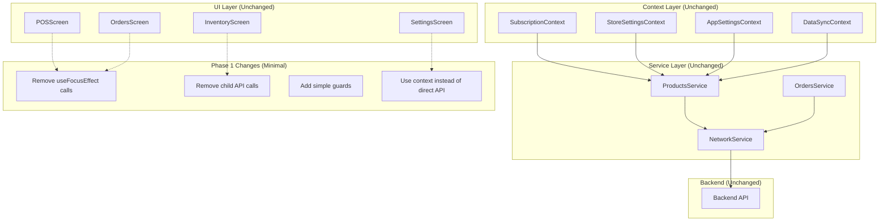

# Design Document: API Phase 1 Optimization

## Overview

This design document outlines the surgical approach for Phase 1 API optimization in the FlowPOS application. The focus is on eliminating API noise through targeted removal of duplicate calls, lifecycle misuse fixes, and simple guards - without changing business logic, backend behavior, or UI outcomes.

This is NOT an architectural refactor. It's a focused cleanup that makes API behavior predictable, minimal, and explainable while preserving all existing functionality.

## Architecture

The existing architecture remains unchanged. We only modify the trigger patterns and add minimal guards:



## Components and Interfaces

### 1. Screen Lifecycle Pattern (Modified)

**Current Problem**: Screens call APIs on both mount AND focus, causing duplicates.

**Phase 1 Solution**: Remove focus-based calls, keep only mount-based calls.

```javascript
// BEFORE (Problematic)
const SomeScreen = () => {
  useEffect(() => {
    fetchData(); // Called on mount
  }, []);
  
  useFocusEffect(
    useCallback(() => {
      fetchData(); // Called on focus - DUPLICATE!
    }, [])
  );
};

// AFTER (Phase 1 Fix)
const SomeScreen = () => {
  useEffect(() => {
    fetchData(); // Called on mount only
  }, []);
  
  // useFocusEffect removed unless strictly required
};
```

### 2. Parent-Child API Ownership (Modified)

**Current Problem**: Parent fetches data, child also fetches same data.

**Phase 1 Solution**: Remove child API calls, use props/context.

```javascript
// BEFORE (Problematic)
const ParentScreen = () => {
  const [data, setData] = useState(null);
  
  useEffect(() => {
    fetchData().then(setData); // Parent fetches
  }, []);
  
  return <ChildComponent />;
};

const ChildComponent = () => {
  const [data, setData] = useState(null);
  
  useEffect(() => {
    fetchData().then(setData); // Child also fetches - DUPLICATE!
  }, []);
};

// AFTER (Phase 1 Fix)
const ParentScreen = () => {
  const [data, setData] = useState(null);
  
  useEffect(() => {
    fetchData().then(setData); // Parent owns the fetch
  }, []);
  
  return <ChildComponent data={data} />;
};

const ChildComponent = ({ data }) => {
  // No API call, receives data via props
};
```

### 3. Context Usage Pattern (Modified)

**Current Problem**: Screens call APIs directly instead of using existing contexts.

**Phase 1 Solution**: Replace direct API calls with context reads.

```javascript
// BEFORE (Problematic)
const SettingsScreen = () => {
  const [storeInfo, setStoreInfo] = useState(null);
  
  useEffect(() => {
    // Direct API call bypasses StoreSettingsContext
    NetworkService.apiCall('/api/store').then(setStoreInfo);
  }, []);
};

// AFTER (Phase 1 Fix)
const SettingsScreen = () => {
  // Use existing context instead of direct API
  const { storeSettings } = useStoreSettings();
  
  // No direct API call needed
};
```

### 4. Simple Guard Pattern (New, Minimal)

**Phase 1 Solution**: Add minimal guards to prevent rapid refetches.

```javascript
// Simple timestamp-based guard
const useSimpleGuard = (fetchFn, guardTimeMs = 30000) => {
  const lastFetchRef = useRef(null);
  
  const guardedFetch = useCallback(() => {
    const now = Date.now();
    const lastFetch = lastFetchRef.current;
    
    // Simple guard: skip if fetched recently
    if (lastFetch && (now - lastFetch < guardTimeMs)) {
      return;
    }
    
    lastFetchRef.current = now;
    fetchFn();
  }, [fetchFn, guardTimeMs]);
  
  return guardedFetch;
};
```

## Data Models

### API Call Audit Record

```javascript
interface APICallAudit {
  endpoint: string;
  triggerType: 'mount' | 'focus' | 'user-action' | 'background';
  component: string;
  timestamp: number;
  removed: boolean; // true if call was removed in Phase 1
  reason: string;   // reason for removal
}
```

### Guard State

```javascript
interface GuardState {
  lastFetch: number | null;
  guardActive: boolean;
}
```

## Error Handling

Phase 1 does NOT change error handling. All existing error patterns remain unchanged:

- Network errors continue to be handled the same way
- Loading states remain identical
- Error messages stay the same
- Retry logic (if any) is preserved

The only change is WHEN errors might occur (fewer API calls = fewer potential errors).

## Testing Strategy

### Unit Tests

Unit tests will verify that Phase 1 changes work correctly:

1. **Lifecycle Tests**: Verify mount triggers API, focus does not
2. **Ownership Tests**: Verify parent fetches, child receives props
3. **Context Tests**: Verify context usage instead of direct API calls
4. **Guard Tests**: Verify simple guards prevent rapid refetches
5. **Preservation Tests**: Verify user actions still trigger immediately

### Integration Tests

Integration tests will verify no functionality is broken:

1. **Flow Tests**: Verify all user flows work identically
2. **Data Tests**: Verify all data still loads correctly
3. **Navigation Tests**: Verify navigation still works
4. **Error Tests**: Verify error handling unchanged

**Configuration**:
- Standard Jest testing framework
- Focus on regression prevention
- Verify identical user experience

## Correctness Properties

*A property is a characteristic or behavior that should hold true across all valid executions of a system - essentially, a formal statement about what the system should do. Properties serve as the bridge between human-readable specifications and machine-verifiable correctness guarantees.*

### Property 1: Lifecycle API Call Deduplication

*For any* screen component and any combination of mount, focus, and navigation events occurring within the same user interaction, only one API call SHALL be made per endpoint.

**Validates: Requirements 1.1, 1.3, 1.4**

### Property 2: Navigation Cache Utilization

*For any* navigation back to a previously visited screen, if cached data exists and is not stale, no API call SHALL be triggered.

**Validates: Requirements 1.2, 3.2**

### Property 3: Single Component API Ownership

*For any* data requirement shared between parent and child components, only the parent component SHALL make the API call, and child components SHALL receive data via props or context.

**Validates: Requirements 2.1, 2.2, 2.3, 2.4**

### Property 4: Focus Event API Elimination

*For any* screen focus event, API calls SHALL only be triggered if explicitly required for critical real-time data, otherwise focus events SHALL not trigger API calls.

**Validates: Requirements 3.1, 3.4, 5.3**

### Property 5: Context-First Data Access

*For any* request for store settings, app settings, or subscription data, the system SHALL use existing contexts (StoreSettingsContext, AppSettingsContext, SubscriptionContext) instead of making direct API calls.

**Validates: Requirements 4.1, 4.2, 4.3, 4.4**

### Property 6: Mount-Only Data Fetching

*For any* screen initialization, data fetching SHALL occur only on initial mount, not on subsequent focus or navigation events.

**Validates: Requirements 5.1, 5.4**

### Property 7: Simple Guard Implementation

*For any* component that remounts within a short timeframe, if data was recently fetched, the API call SHALL be skipped using simple timestamp-based guards without introducing complex state systems.

**Validates: Requirements 6.1, 6.2, 6.3, 6.5**

### Property 8: User Action Immediacy

*For any* user-triggered action (create, update, delete, pull-to-refresh), the corresponding API call SHALL execute immediately without guards, delays, or cache checks.

**Validates: Requirements 7.1, 7.2, 7.3, 7.4, 7.5**

### Property 9: Business Logic Preservation

*For any* existing calculation, validation, data transformation, or error handling logic, the behavior SHALL remain completely unchanged after Phase 1 optimization.

**Validates: Requirements 8.1, 8.2, 8.3, 8.4, 8.5**

### Property 10: User Experience Preservation

*For any* user interaction flow, the loading states, error messages, navigation behavior, visual feedback, and overall experience SHALL remain identical to pre-optimization behavior.

**Validates: Requirements 9.1, 9.2, 9.3, 9.4, 9.5**

### Property 11: API Contract Preservation

*For any* API endpoint, the URL, request format, response format, and error handling SHALL remain completely unchanged.

**Validates: Requirements 1.5**

### Property 12: Architecture Constraint Compliance

*For any* Phase 1 change, no new contexts, caching layers, or complex state management systems SHALL be introduced.

**Validates: Requirements 4.5, 6.5**