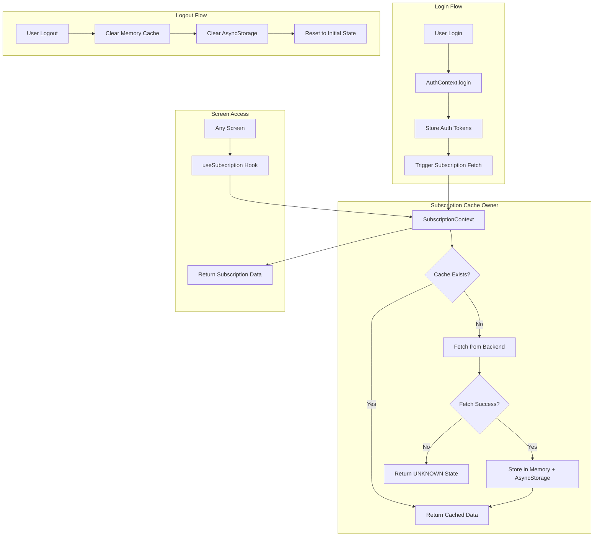

# Design Document: Subscription Caching

## Overview

This design implements a centralized subscription caching system for FlowPOS that fetches subscription data once per session and provides it globally to all screens. The implementation uses a React Context as the single owner of subscription state, with in-memory caching backed by AsyncStorage for persistence across app restarts.

The design prioritizes:
- Single source of truth for subscription data
- Minimal API calls (once per session)
- Non-blocking cache operations
- Safe defaults when data is unavailable
- No plan-based feature enforcement

## Architecture



## Components and Interfaces

### 1. SubscriptionContext (Cache Owner)

The single centralized owner of subscription data. All screens must access subscription data through this context.

```javascript
// SubscriptionContext Interface
interface SubscriptionContextValue {
  // Subscription Data (read-only, informational)
  subscription: SubscriptionData | null;
  isLoading: boolean;
  error: string | null;
  
  // Cache Status
  isCached: boolean;
  lastFetchedAt: number | null;
  
  // Actions
  refreshSubscription: () => Promise<void>;
  clearCache: () => Promise<void>;
  updateSubscriptionCache: (data: SubscriptionData) => Promise<void>;
}

interface SubscriptionData {
  plan: string;           // 'trial' | 'starter' | 'growth' | 'enterprise'
  status: string;         // 'active' | 'expired' | 'cancelled' | 'UNKNOWN'
  startedAt: string | null;
  expiresAt: string | null;
  limits: SubscriptionLimits;
  features: SubscriptionFeatures;
  planDetails: PlanDetails;
}

interface SubscriptionLimits {
  maxProducts: number | 'unlimited';
  maxTransactions: number | 'unlimited';
  maxDevices: number;
  storageGB: number;
}

interface SubscriptionFeatures {
  [featureName: string]: boolean;
}

interface PlanDetails {
  name: string;
  price: number;
  currency: string;
}
```

### 2. useSubscription Hook

A hook that provides access to subscription data from any screen. This replaces direct API calls.

```javascript
// useSubscription Hook Interface
function useSubscription(): {
  // Data
  subscription: SubscriptionData | null;
  plan: string;
  status: string;
  limits: SubscriptionLimits;
  features: SubscriptionFeatures;
  
  // State
  isLoading: boolean;
  error: string | null;
  isCached: boolean;
  
  // Actions
  refreshSubscription: () => Promise<void>;
}
```

### 3. SubscriptionService (API Layer)

Handles API communication. Only called by SubscriptionContext, never by screens directly.

```javascript
// SubscriptionService Interface
class SubscriptionService {
  // Fetch subscription status from backend
  static async getSubscriptionStatus(token: string): Promise<SubscriptionData>;
  
  // Update subscription (write-through)
  static async upgradeSubscription(token: string, plan: string): Promise<SubscriptionData>;
}
```

## Data Models

### Subscription Cache Structure

```javascript
// In-Memory Cache
const subscriptionCache = {
  data: SubscriptionData | null,
  timestamp: number | null,
  isLoading: boolean,
  inFlightPromise: Promise<SubscriptionData> | null  // For request deduplication
};

// AsyncStorage Keys
const STORAGE_KEYS = {
  SUBSCRIPTION_DATA: '@flowpos_subscription_data',
  SUBSCRIPTION_TIMESTAMP: '@flowpos_subscription_timestamp'
};
```

### Safe Default State (UNKNOWN)

When subscription data cannot be fetched or is unavailable:

```javascript
const UNKNOWN_SUBSCRIPTION_STATE: SubscriptionData = {
  plan: 'unknown',
  status: 'UNKNOWN',
  startedAt: null,
  expiresAt: null,
  limits: {
    maxProducts: 'unlimited',      // No enforcement
    maxTransactions: 'unlimited',  // No enforcement
    maxDevices: 999,               // No enforcement
    storageGB: 999                 // No enforcement
  },
  features: {},                    // Empty - no feature checks
  planDetails: {
    name: 'Unknown',
    price: 0,
    currency: 'INR'
  }
};
```

## Correctness Properties

*A property is a characteristic or behavior that should hold true across all valid executions of a system—essentially, a formal statement about what the system should do. Properties serve as the bridge between human-readable specifications and machine-verifiable correctness guarantees.*

### Property 1: Request Deduplication

*For any* set of concurrent subscription data requests, only one API call SHALL be made to the backend, and all requesters SHALL receive identical subscription data.

**Validates: Requirements 1.3, 1.4, 1.5**

### Property 2: Data Persistence Completeness

*For any* valid subscription API response, the cache SHALL store all fields (plan, status, startedAt, expiresAt, limits, features) in both in-memory state and AsyncStorage.

**Validates: Requirements 2.2, 2.3**

### Property 3: Cache-First with Fallback

*For any* subscription data request: if cache exists, cached data is returned immediately without API call; if cache is missing and fetch succeeds, the response is stored in cache before returning.

**Validates: Requirements 3.1, 3.3**

### Property 4: Write-Through Cache Update

*For any* successful subscription update API call, the cache SHALL be updated immediately with the response data, and no additional fetch API call SHALL be made.

**Validates: Requirements 6.1, 6.2**

### Property 5: Session Isolation

*For any* user logout, all subscription data SHALL be cleared from both memory and persistent storage; *for any* subsequent login, fresh subscription data SHALL be fetched from the backend.

**Validates: Requirements 7.1, 7.2, 7.3, 7.4**

### Property 6: Failsafe Behavior

*For any* error during subscription fetch (network failure, API error, timeout), the subscription state SHALL be set to UNKNOWN, no features SHALL be blocked or restricted, and the app SHALL continue functioning normally.

**Validates: Requirements 8.2, 8.3, 8.5, 8.6**

### Property 7: Restart Recovery

*For any* app restart where AsyncStorage contains subscription data, the data SHALL be loaded into memory immediately; if the cached data is stale, a background refresh SHALL be triggered without blocking the UI.

**Validates: Requirements 10.1, 10.2, 10.4**

### Property 8: API Response Parsing

*For any* valid subscription API response matching the existing backend format, parsing SHALL produce a correctly structured SubscriptionData object with all required fields.

**Validates: Requirements 9.4**

## Error Handling

### Error Scenarios and Responses

| Scenario | Response | User Impact |
|----------|----------|-------------|
| Network failure during fetch | Set status to UNKNOWN, log error | None - app continues |
| API returns error | Set status to UNKNOWN, log error | None - app continues |
| AsyncStorage read fails | Use in-memory cache or fetch | None - transparent fallback |
| AsyncStorage write fails | Continue with in-memory cache | None - data available in session |
| Invalid API response | Set status to UNKNOWN, log error | None - app continues |
| Token expired | Trigger re-authentication flow | User redirected to login |

### Error Logging

```javascript
// Error logging format (internal only, not exposed to users)
console.error('[SubscriptionCache] Error:', {
  operation: 'fetch' | 'store' | 'clear',
  error: error.message,
  timestamp: new Date().toISOString()
});
```

## Testing Strategy

### Unit Tests

Unit tests verify specific examples and edge cases:

1. **Cache initialization** - Verify cache starts empty
2. **Successful fetch** - Verify data is stored correctly
3. **Cache hit** - Verify cached data is returned without API call
4. **Cache miss** - Verify API is called when cache is empty
5. **Logout cleanup** - Verify all data is cleared
6. **Error handling** - Verify UNKNOWN state on errors
7. **AsyncStorage persistence** - Verify data survives memory clear

### Property-Based Tests

Property-based tests verify universal properties across many generated inputs using a PBT library (e.g., fast-check for JavaScript):

1. **Request Deduplication Property** - Generate random concurrent requests, verify single API call
2. **Data Persistence Property** - Generate random subscription responses, verify complete storage
3. **Cache-First Property** - Generate random cache states, verify correct behavior
4. **Write-Through Property** - Generate random updates, verify cache consistency
5. **Session Isolation Property** - Generate random user sessions, verify no data leakage
6. **Failsafe Property** - Generate random error scenarios, verify UNKNOWN state
7. **Restart Recovery Property** - Generate random cached states, verify immediate availability
8. **API Parsing Property** - Generate random valid API responses, verify correct parsing

Each property test should run minimum 100 iterations to ensure comprehensive coverage.

### Test Configuration

```javascript
// Property test configuration
const PBT_CONFIG = {
  numRuns: 100,
  seed: Date.now(),
  verbose: true
};

// Test annotation format
// Feature: subscription-caching, Property 1: Request Deduplication
```

## Implementation Notes

### Integration with Existing Code

1. **AuthContext Integration**: The SubscriptionContext will be triggered after successful login in AuthContext
2. **Existing useSubscription Hook**: The existing hook will be refactored to use SubscriptionContext
3. **FeatureService**: Will be updated to read from SubscriptionContext instead of making direct API calls
4. **SubscriptionScreen**: Will consume data from useSubscription hook instead of fetching directly

### Migration Strategy

1. Create SubscriptionContext as the new cache owner
2. Update useSubscription hook to use SubscriptionContext
3. Update AuthContext to trigger subscription fetch after login
4. Update logout flow to clear subscription cache
5. Update screens to use useSubscription hook (most already do)
6. Remove direct API calls from screens

### Non-Goals (Explicitly Out of Scope)

- Plan-based feature enforcement
- Limit checking or blocking
- UI hiding based on plan
- Payment gateway integration
- Subscription expiry enforcement
- canUserPerformAction calls
