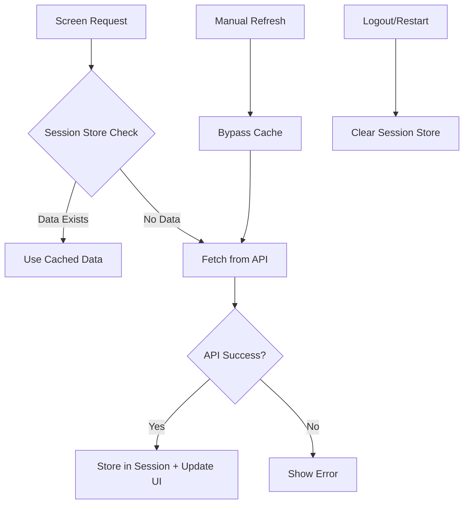

# Design Document

## Overview

This design implements UI-level performance optimizations for FlowPOS through a four-phase approach that reduces redundant API calls while maintaining all correctness guarantees. The system introduces session-level caching and intelligent data reuse without changing any API contracts or business logic.

## Architecture

### Core Principle
**Optimize repetition, never authority. Backend decides truth; UI decides efficiency.**

The architecture maintains a strict separation between:
- **Authoritative Data**: Always comes from backend APIs
- **UI Optimization**: Reduces redundant fetches of the same authoritative data
- **Business Logic**: Remains unchanged in backend services

### Session Store Architecture



## Components and Interfaces

### 1. SessionProductStore

**Purpose**: In-memory storage for product data during app session

**Interface**:
```javascript
class SessionProductStore {
  // Core data management
  getProducts(): Product[] | null
  setProducts(products: Product[], timestamp: number): void
  clear(): void
  
  // Metadata
  getLastFetchTime(): number | null
  hasData(): boolean
  
  // Update operations (post-API success only)
  updateProduct(productId: string, updates: Partial<Product>): void
  addProduct(product: Product): void
  removeProduct(productId: string): void
}
```

**Responsibilities**:
- Hold latest products array in memory only
- Track last fetch timestamp (used for diagnostics and future staleness checks, not for correctness decisions)
- Provide read & write helpers
- Clear on logout/restart
- Never persist to AsyncStorage
- **Critical**: Never used for business logic or inventory validation decisions

### 2. ProductFetchCoordinator

**Purpose**: Coordinate product fetching across all screens

**Interface**:
```javascript
class ProductFetchCoordinator {
  // Primary fetch method used by all screens
  async fetchProducts(options: {
    forceRefresh?: boolean,
    screenName?: string
  }): Promise<Product[]>
  
  // Post-success update methods
  onProductCreated(product: Product): void
  onProductUpdated(productId: string, updates: Partial<Product>): void
  onProductDeleted(productId: string): void
}
```

**Logic Flow**:
1. Check session store for existing data
2. If data exists and not force refresh → return cached data
3. If no data or force refresh → call API
4. On API success → store result and return
5. On API failure → return error, don't modify cache
6. **Important**: If Session Store has data and API fails during forced refresh, existing cached data remains usable

### 3. UIUpdatePropagator

**Purpose**: Propagate data changes to all relevant UI components

**Interface**:
```javascript
class UIUpdatePropagator {
  // Register screens for updates
  registerScreen(screenName: string, updateCallback: () => void): void
  unregisterScreen(screenName: string): void // Must be called on screen unmount to prevent memory leaks
  
  // Trigger updates after successful API operations
  propagateProductUpdate(): void
  propagateOrderUpdate(): void
  propagateInventoryUpdate(): void // UI display only, does not influence backend validation
}
```

**Critical Implementation Note**: 
- Updates only triggered AFTER backend API success
- No optimistic updates allowed
- Failed APIs trigger no UI changes

### 4. ComputationCache

**Purpose**: Cache expensive computations like analytics

**Interface**:
```javascript
class ComputationCache {
  // Analytics caching
  getAnalytics(ordersHash: string): AnalyticsData | null // ordersHash must be deterministic and change when orders meaningfully change
  setAnalytics(ordersHash: string, analytics: AnalyticsData): void
  
  // Feature flag caching (per render cycle only - never persist across screens or sessions)
  getFeatureFlags(userId: string, renderCycle: string): FeatureFlags | null
  setFeatureFlags(userId: string, renderCycle: string, flags: FeatureFlags): void
  
  // Clear methods
  clearAnalytics(): void
  clearFeatureFlags(): void
  clearAll(): void
}
```

## Data Models

### SessionData
```javascript
interface SessionData {
  products: {
    data: Product[] | null;
    lastFetch: number | null;
  };
  analytics: {
    [ordersHash: string]: AnalyticsData;
  };
  featureFlags: {
    [key: string]: FeatureFlags;
  };
}
```

### UpdateEvent
```javascript
interface UpdateEvent {
  type: 'PRODUCT_CREATED' | 'PRODUCT_UPDATED' | 'PRODUCT_DELETED' | 'ORDER_CREATED';
  payload: any;
  timestamp: number;
  success: boolean; // Only true events trigger UI updates
}
```

## Correctness Properties

*A property is a characteristic or behavior that should hold true across all valid executions of a system-essentially, a formal statement about what the system should do. Properties serve as the bridge between human-readable specifications and machine-verifiable correctness guarantees.*

### Property Reflection

After analyzing all acceptance criteria, I identified several areas where properties can be consolidated to eliminate redundancy:

- **Product API Success Properties (3.1, 3.2, 3.3)**: Can be combined into one comprehensive property about post-success cache updates
- **API Contract Preservation Properties (8.1-8.8)**: Can be grouped into broader contract preservation properties
- **Validation Properties (10.1-10.6)**: Can be consolidated into phase validation properties

### Core Properties

**Property 1: Session Store Lifecycle Management**
*For any* app session, when the app starts or user logs in, the session store should be empty, and when user logs out or app restarts, the session store should be completely cleared
**Validates: Requirements 1.1, 1.5, 1.6**

**Property 2: API Response Caching**
*For any* successful API response containing products, the session store should cache the result with timestamp and make it available for subsequent requests
**Validates: Requirements 1.2, 1.4**

**Property 3: Cache Hit Optimization**
*For any* screen requesting products when session store contains valid data, the system should use cached data immediately without making API calls
**Validates: Requirements 1.3**

**Property 4: Storage Implementation Constraint**
*For any* session store operation, no AsyncStorage calls should be made, ensuring in-memory only storage
**Validates: Requirements 1.7**

**Property 5: Manual Refresh Override**
*For any* pull-to-refresh action on any screen, the system should bypass session store, call API directly, and update cache only on success
**Validates: Requirements 2.1, 2.2, 2.3, 2.4**

**Property 6: Post-Success UI Propagation**
*For any* successful product API operation (create, update, delete), the system should update session store and trigger UI re-render, but make no changes on API failure
**Validates: Requirements 3.1, 3.2, 3.3, 3.4**

**Property 7: No Optimistic Updates**
*For any* API operation, UI updates should only occur after API success confirmation, never before
**Validates: Requirements 3.5, 4.6**

**Property 8: Order Success Propagation**
*For any* successful order creation, the system should update in-memory product stock, orders list, and counters, but make no changes on failure
**Validates: Requirements 4.1, 4.2, 4.3, 4.4**

**Property 9: Business Logic Preservation**
*For any* optimization implementation, all backend inventory validation and order creation APIs should continue to be called as before
**Validates: Requirements 4.5, 8.3, 8.4**

**Property 10: Analytics Computation Efficiency**
*For any* analytics screen load with unchanged orders data, previously computed results should be reused, but recomputation should occur when data changes or manual refresh happens
**Validates: Requirements 5.1, 5.2, 5.3**

**Property 11: Feature Flag Evaluation Efficiency**
*For any* screen render cycle, feature flags should be evaluated once and results reused within that cycle
**Validates: Requirements 6.1, 6.2**

**Property 12: User Experience Preservation**
*For any* optimization implementation, analytics numbers and feature access behavior should remain unchanged from user perspective
**Validates: Requirements 5.4, 6.3**

**Property 13: API Contract Preservation**
*For any* optimization implementation, API endpoints, payloads, and all payment/order/auth processing behavior should remain completely unchanged
**Validates: Requirements 8.1, 8.2, 8.5, 8.6, 8.7, 8.8**

**Property 14: Phase Validation Compliance**
*For any* completed optimization phase, manual refresh should hit API, logout should clear session memory, app restart should refetch data, failed APIs should not mutate UI, user behavior should be unchanged, and network calls should be reduced but not eliminated
**Validates: Requirements 10.1, 10.2, 10.3, 10.4, 10.5, 10.6**

<function_calls>
<invoke name="prework">
<parameter name="featureName">ui-performance-optimization

## Error Handling

### API Failure Handling
- **Failed Product Fetch**: Return error to UI, don't modify session store
- **Failed Product Operations**: No UI updates, no cache modifications
- **Failed Order Creation**: No inventory updates, no UI changes
- **Network Errors**: Graceful degradation, preserve existing cache

### Cache Corruption Prevention
- **Invalid Data Detection**: Validate cached data structure before use
- **Timestamp Validation**: Ensure timestamps are valid numbers
- **Fallback Strategy**: On cache corruption, clear cache and fetch from API

### Memory Management
- **Session Store Size Limits**: Monitor memory usage, implement cleanup if needed
- **Computation Cache Limits**: Implement LRU eviction for analytics cache
- **Memory Leak Prevention**: Ensure proper cleanup on logout/restart

## Testing Strategy

### Dual Testing Approach
This implementation requires both unit tests and property-based tests for comprehensive coverage:

**Unit Tests** focus on:
- Specific examples of cache hit/miss scenarios
- Edge cases like empty cache, corrupted data
- Integration points between components
- Error conditions and failure handling

**Property-Based Tests** focus on:
- Universal properties that hold for all inputs
- Comprehensive input coverage through randomization
- Verification of correctness properties across many scenarios

### Property-Based Testing Configuration
- **Testing Framework**: Use Jest with fast-check for property-based testing
- **Test Iterations**: Minimum 100 iterations per property test
- **Test Tagging**: Each property test must reference its design document property
- **Tag Format**: `// Feature: ui-performance-optimization, Property {number}: {property_text}`

### Critical Test Scenarios

**Session Store Tests**:
- Verify cache lifecycle (empty → populated → cleared)
- Test cache hit/miss behavior across all screens
- Validate manual refresh override functionality

**UI Propagation Tests**:
- Test post-success updates for all API operations
- Verify no updates occur on API failures
- Test cross-screen update propagation

**Business Logic Preservation Tests**:
- Verify all critical API calls are still made
- Test inventory validation is not bypassed
- Ensure order processing remains unchanged

**Performance Tests**:
- Measure API call reduction
- Verify computation reuse effectiveness
- Test memory usage stays within bounds

### Rollback Testing
- Test that rollback disables optimizations cleanly
- Verify no data loss during rollback
- Ensure system returns to original behavior

## Implementation Phases

### Phase A: Products Read Reuse (Low Risk)
1. **A1**: Create SessionProductStore with in-memory storage
2. **A2**: Modify product fetch flow in all screens (POSScreen, ManageScreen, InventoryScreen, ProductOnboardingScreen)
3. **A3**: Implement manual refresh override for pull-to-refresh

### Phase B: UI Propagation After API Success (Medium Risk)
1. **B1**: Implement post-success cache updates for product operations
2. **B2**: Implement post-success UI propagation for order operations

### Phase C: Computation Reuse (Internal Optimization)
1. **C1**: Implement analytics computation caching
2. **C2**: Implement feature flag evaluation caching

### Phase D: Status & Background (Optional)
1. **D1**: Implement service status session caching (optional, low priority)

### Validation After Each Phase
- Manual refresh hits API
- Logout clears session memory
- App restart refetches data
- Failed API → no UI mutation
- No behavior change observed by user
- Network calls reduced (not eliminated)

## Risk Mitigation

### Critical Risk: Inventory Authority Confusion
**Risk**: Implementation might accidentally treat cached stock as authoritative for inventory decisions
**Mitigation**: 
- Cached stock is UI-only, never used for business logic
- All inventory validation must go through backend APIs
- Stock updates only occur post-API success
- Clear separation between UI optimization and business logic
- **Code Review Rule**: No business logic may read from SessionProductStore

### Implementation Watch-Outs
1. **Screen Registration**: Ensure screens unregister from UIUpdatePropagator on unmount to prevent memory leaks
2. **Analytics Hash Quality**: Ensure ordersHash is deterministic, changes when orders meaningfully change, and is not index/order dependent unless required
3. **Feature Flag Scope**: Keep feature flag caching scoped to render cycle only - never persist across screens or sessions

### Rollback Strategy
If any phase causes issues:
1. Disable session reuse, return to direct API reads
2. Keep all services untouched
3. Ensure no data loss
4. Implementation should make rollback simple

### Performance Monitoring
- Track API call reduction metrics
- Monitor memory usage of session store
- Measure UI response time improvements
- Alert on any business logic bypasses